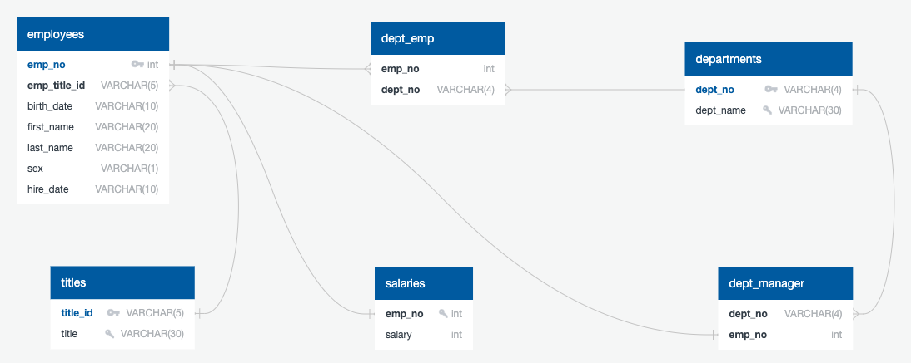

# <p align="center">Building Employee Database using Postgres !!</p>

|                                                                           |                                                                                    |
|---------------------------------------------------------------------------|------------------------------------------------------------------------------------|
| <b>In this project, we answer some of the critical questions through Data Engineering and further analysis using employee data from the year 1980 to 1990, available as CSV files. We have to import the files to tables in Postgres and perform data manipulation and further analyse the cleaned data to get meaningful results.</b>                                                                |                                     |
|                                                                           |                                                                                    |

------------------------------------------------------------------------------------------------------------------------------------------------------------------

<p align="center">
  <b>PostgreSQL, also known as Postgres is a free, enterprise-class relational Data Base Management System.</b><br>
  <a href="https://www.postgresql.org/">Postgres Website</a>
  <br><br>
   
</p>
<br><br>


## Data Modeling

Inspect the CSVs and sketch out an ERD of the tables. Courtesy [http://www.quickdatabasediagrams.com](http://www.quickdatabasediagrams.com).

- Blue attributes (Also Big Key symbol) indicates Primary Key (PK).
- More than one PK in one table indicates the composite key.
- The small tilted key indicates the UNIQUE attributes.
- By default, all the attributes are NOT-NULL. "?" indicates "NULLABLE".
- FK appears as bold black.
- Some attributes can be Primary Key (PK) and Foreign Key (FK) together. In that case, PK dominates and appears in Blue.

 

------------------------------------------------------------------------------------------------------------------------------------------------------------------
## Data Engineering

### Database Creation
**Create a DB named "employee_DB" with the following details**
```sql
  CREATE DATABASE "employee_DB"
      WITH 
      OWNER = postgres
      ENCODING = 'UTF8'
      CONNECTION LIMIT = -1;

  COMMENT ON DATABASE "employee_DB"
      IS 'employee DB ';
```
**Use [this schema](Output/Schema.sql) to create the tables**

- All tables have primary key. Some primary keys also serve as Foreign keys (Special syntax is being used to create them)
  Please refer [this link](https://dba.stackexchange.com/questions/253429/when-the-primary-key-is-also-the-foreign-key-in-postgres) for further details.
  
  - "emp_no" in table "dept_manager" is a Primary Key as well as a Foreign Key referencing "emp_no" in "employees" table.
  - Similarly, "emp_no" in table "salaries" is a Primary Key as well as a Foreign Key referencing "emp_no" in "employees" table
  
- All the datatypes are mentioned with by default NOT NULL constraint, with an exception of "sex" attribute in "employees" table, as I believe, employees have right not to disclose gender!

- Unique constraints are given to appropriate attributes. (Primary Keys are by default "UNIQUE")
  - "title" in table "titles" (There is no need of recording multiple entries for the same title, "title_id" & "title" have a one-to-one mapping)
  - "dept_name" in table "departments" (Same reason above)
  
- "composite key" is created for table "dept_emp" as both "emp_no" and "dept_no" are not unique, as some employee seems to work in multiple departments!
  The tuple created with both these attribute uniquely identifies a row. Also, as each of these attributes is a foreign key, this composite key is also a compound key.
  
- Tables are created in the order below to handle foreign keys.
  1. "titles"
  1. "employees"
  1. "salaries"
  1. "departments"
  1. "dept_emp"
  1. "dept_manager"
  
  <br>
  
 


- Import each CSV file into the corresponding SQL table. We can import either graphically (as shown below with examples of first two tables; similar procedure for other tables too) or using scripts. The order in which the import is done should be strictly the same order in which tables are created. i.e, "titles" -> "employees" -> "salaries" -> "departments" -> "dept_emp" -> "dept_manager"

<br>

 

- For the command-line approach, **copy all the data into a folder which is accessible to "postgres" user recursively. (say /tmp)**

```
$cp data/*.csv /tmp/
$ ls -lrt /tmp/
-rwxr-xr-x@ 1 XXX  wheel       210 Jul 12 22:09 departments.csv
-rwxr-xr-x@ 1 XXX  wheel   3879781 Jul 12 22:09 dept_emp.csv
-rwxr-xr-x@ 1 XXX  wheel       302 Jul 12 22:09 dept_manager.csv
-rwxr-xr-x@ 1 XXX  wheel  14992658 Jul 12 22:09 employees.csv
-rwxr-xr-x@ 1 XXX  wheel   3811614 Jul 12 22:09 salaries.csv
-rwxr-xr-x@ 1 XXX  wheel       147 Jul 12 22:09 titles.csv
```
**Use [this script](Output/postgres-employee-data-insert-data.sql) to insert data into the corresponding tables**


#### Data Analysis

Once you have a complete database, do the following:

1. List the following details of each employee: employee number, last name, first name, sex, and salary.

2. List first name, last name, and hire date for employees who were hired in 1986.

3. List the manager of each department with the following information: department number, department name, the manager's employee number, last name, first name.

4. List the department of each employee with the following information: employee number, last name, first name, and department name.

5. List first name, last name, and sex for employees whose first name is "Hercules" and last names begin with "B."

6. List all employees in the Sales department, including their employee number, last name, first name, and department name.

7. List all employees in the Sales and Development departments, including their employee number, last name, first name, and department name.

8. In descending order, list the frequency count of employee last names, i.e., how many employees share each last name.

## Bonus (Optional)

As you examine the data, you are overcome with a creeping suspicion that the dataset is fake. You surmise that your boss handed you spurious data in order to test the data engineering skills of a new employee. To confirm your hunch, you decide to take the following steps to generate a visualization of the data, with which you will confront your boss:

1. Import the SQL database into Pandas. (Yes, you could read the CSVs directly in Pandas, but you are, after all, trying to prove your technical mettle.) This step may require some research. Feel free to use the code below to get started. Be sure to make any necessary modifications for your username, password, host, port, and database name:

   ```sql
   from sqlalchemy import create_engine
   engine = create_engine('postgresql://localhost:5432/<your_db_name>')
   connection = engine.connect()
   ```

* Consult [SQLAlchemy documentation](https://docs.sqlalchemy.org/en/latest/core/engines.html#postgresql) for more information.

* If using a password, do not upload your password to your GitHub repository. See [https://www.youtube.com/watch?v=2uaTPmNvH0I](https://www.youtube.com/watch?v=2uaTPmNvH0I) and [https://help.github.com/en/github/using-git/ignoring-files](https://help.github.com/en/github/using-git/ignoring-files) for more information.

2. Create a histogram to visualize the most common salary ranges for employees.

3. Create a bar chart of average salary by title.

## Epilogue

Evidence in hand, you march into your boss's office and present the visualization. With a sly grin, your boss thanks you for your work. On your way out of the office, you hear the words, "Search your ID number." You look down at your badge to see that your employee ID number is 499942.

## Submission

* Create an image file of your ERD.

* Create a `.sql` file of your table schemata.

* Create a `.sql` file of your queries.

* (Optional) Create a Jupyter Notebook of the bonus analysis.

* Create and upload a repository with the above files to GitHub and post a link on BootCamp Spot.

### Copyright

Trilogy Education Services © 2019. All Rights Reserved.
