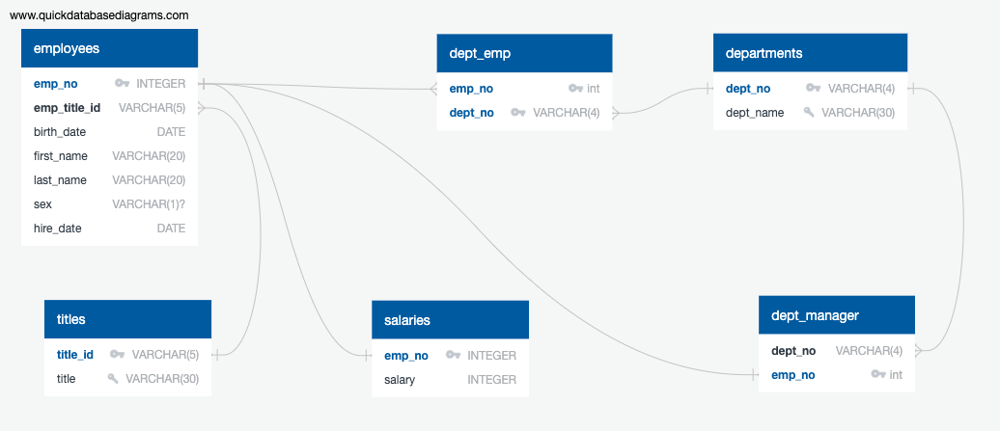
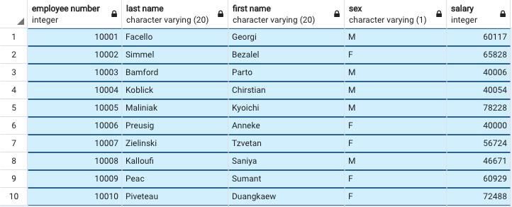
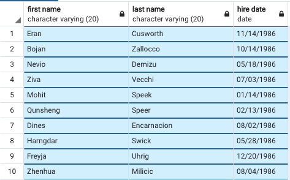
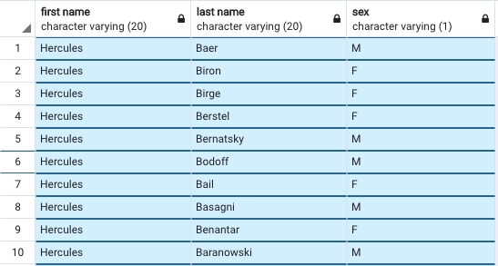
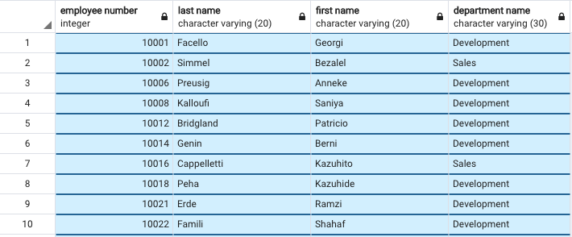
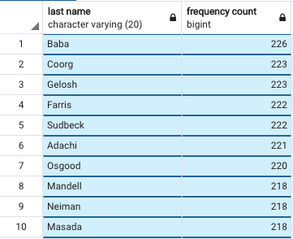
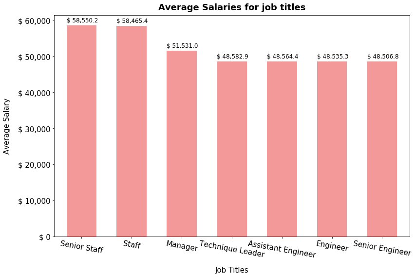

# <p align="center">Building Employee Database using Postgres !!</p>

|                                                                           |                                                                                    |
|---------------------------------------------------------------------------|------------------------------------------------------------------------------------|
| <b>In this project, we answer some of the critical questions through Data Engineering and further analysis using employee data from the year 1980 to 1990, available as CSV files. We have to import the files to tables in Postgres and perform data manipulation and further analyse the cleaned data to get meaningful results.</b>                                                                |                                     |
|                                                                           |                                                                                    |

------------------------------------------------------------------------------------------------------------------------------------------------------------------

<p align="center">
  <b>PostgreSQL, also known as Postgres is a free, enterprise-class relational Data Base Management System.</b><br>
  <a href="https://www.postgresql.org/">Postgres Website</a>
  <br><br>
   
</p>
<br><br>


## Data Modeling

Inspect the CSVs and sketch out an ERD of the tables. Courtesy [http://www.quickdatabasediagrams.com](http://www.quickdatabasediagrams.com).

- Blue attributes (Also Big Key symbol) indicate Primary Key (PK).
- More than one PK in one table indicates the composite key.
- The small tilted key indicates UNIQUE attributes.
- By default, all the attributes are NOT-NULL. `?` indicates `NULLABLE`.
- FK appears as bold black.
- Some attributes can be Primary Key (PK) and Foreign Key (FK) together. In that case, PK dominates and appears in Blue.

 

------------------------------------------------------------------------------------------------------------------------------------------------------------------
## Data Engineering

### Database Creation
**Create a DB named `employee_DB` with the following details**
```sql
  CREATE DATABASE "employee_DB"
      WITH 
      OWNER = postgres
      ENCODING = 'UTF8'
      CONNECTION LIMIT = -1;

  COMMENT ON DATABASE "employee_DB"
      IS 'employee DB ';
```
**Use [this schema](Output/Schema.sql) to create the tables**

- All tables have primary key. Some primary keys also serve as Foreign keys (Special syntax is being used to create them)
  Please refer [this link](https://dba.stackexchange.com/questions/253429/when-the-primary-key-is-also-the-foreign-key-in-postgres) for further details.
  
  - `emp_no` in table `dept_manager` is a Primary Key as well as a Foreign Key referencing `emp_no` in `employees` table.
  - Similarly, `emp_no` in table `salaries` is a Primary Key as well as a Foreign Key referencing `emp_no` in `employees` table
  
- All the datatypes are mentioned with by default NOT NULL constraint, with an exception of `sex` attribute in `employees` table, as I believe, employees have right not to disclose gender!

- DATE conversion is required in the local Postgres to import the DATE format in CSV. During the data exploration, it is observed that DATE is in the format MDY, hence the local Postgres DB date has to be converted to match that. This can be reverted later once the data insertion is done.

```sql
  SET datestyle to MDY, SQL;
  select now()::date; -- to check
```

- Unique constraints are given to appropriate attributes. (Primary Keys are by default `UNIQUE`)
  - `title` in table `titles` (There is no need of recording multiple entries for the same title, `title_id` & `title` have a one-to-one mapping)
  - `dept_name` in table `departments` (Same reason as mentioned above)
  
- `composite key` is created for table `dept_emp` as both `emp_no` and `dept_no` are not unique, as some employee seems to work in multiple departments!
  The tuple created with both these attribute uniquely identifies a row. Also, as each of these attributes is a foreign key, this composite key is also a compound key.
  
- Tables are created in the order below to handle foreign keys.
  1. `titles`
  1. `employees`
  1. `salaries`
  1. `departments`
  1. `dept_emp`
  1. `dept_manager`
  
  <br>
  
 


- Import each CSV file into the corresponding SQL table. We can import either graphically (as shown below with examples of first two tables; similar procedure for other tables too) or using scripts. The order in which the import is done should be strictly the same order in which tables are created. i.e, `titles` -> `employees` -> `salaries` -> `departments` -> `dept_emp` -> `dept_manager`

<br>

 

- For the command-line approach, **copy all the data into a folder which is accessible to "postgres" user recursively. (say /tmp)**

```
$cp data/*.csv /tmp/
$ ls -lrt /tmp/
-rwxr-xr-x@ 1 XXX  wheel       210 Jul 12 22:09 departments.csv
-rwxr-xr-x@ 1 XXX  wheel   3879781 Jul 12 22:09 dept_emp.csv
-rwxr-xr-x@ 1 XXX  wheel       302 Jul 12 22:09 dept_manager.csv
-rwxr-xr-x@ 1 XXX  wheel  14992658 Jul 12 22:09 employees.csv
-rwxr-xr-x@ 1 XXX  wheel   3811614 Jul 12 22:09 salaries.csv
-rwxr-xr-x@ 1 XXX  wheel       147 Jul 12 22:09 titles.csv
```
**Use [this script](Output/postgres-employee-data-insert-data.sql) to insert data into the corresponding tables**

 

<br>

**The script should finish running successfully as below**

 

<br><br>

## Data Analysis

**The full script [here](Output/Analysis.sql)**

1. List the following details of each employee: employee number, last name, first name, sex, and salary.

   - Create a view with the required data
   
   ```sql
    CREATE VIEW employee_details_and_salary AS
    SELECT emp.emp_no, emp.last_name, emp.first_name, emp.sex, sal.salary
    FROM employees AS emp
    LEFT JOIN salaries AS sal
    ON emp.emp_no = sal.emp_no;

    SELECT COUNT(*) FROM employee_details_and_salary;
    SELECT * FROM employee_details_and_salary LIMIT 10;
   ```
   - A snippet of sample output 
   
    

1. List first name, last name, and hire date for employees who were hired in 1986.

   - Create a view with the required data

    ```sql

    CREATE VIEW employees_hired_in_1986 AS  
    SELECT emp.first_name, emp.last_name, emp.hire_date
    FROM employees as emp
    WHERE EXTRACT(YEAR FROM emp.hire_date) = 1986;

    SELECT COUNT(*) FROM employees_hired_in_1986;
    SELECT * FROM employees_hired_in_1986 LIMIT 10;

    ```
   - A snippet of sample output 
   
     

1. List the manager of each department with the following information: department number, department name, the manager's employee number, last name, first name.

    - Create a view with the required data
  
     ```sql
      CREATE VIEW dept_manager_details AS 
      SELECT dep_mngr.dept_no, depts.dept_name, dep_mngr.emp_no, emp.last_name, emp.first_name 
      FROM dept_manager AS dep_mngr
      LEFT JOIN departments AS depts ON dep_mngr.dept_no = depts.dept_no
      LEFT JOIN employees AS emp ON dep_mngr.emp_no = emp.emp_no;

      SELECT COUNT(*) FROM dept_manager_details;
      SELECT * FROM dept_manager_details LIMIT 10;
     ```
   
    - A snippet of sample output 
   
       


1. List the department of each employee with the following information: employee number, last name, first name, and department name.

   - Create a view with the required data
   
   ```sql
    CREATE VIEW employee_dept_details AS
    SELECT emp.emp_no, emp.last_name, emp.first_name, dept.dept_name
    FROM employees as emp
    LEFT JOIN dept_emp ON emp.emp_no = dept_emp.emp_no
    LEFT JOIN departments AS dept ON dept_emp.dept_no = dept.dept_no;

    SELECT COUNT(*) FROM employee_dept_details;
    SELECT * FROM employee_dept_details LIMIT 10;
   ```
  
   - A snippet of sample output 
   
       

   

1. List first name, last name, and sex for employees whose first name is "Hercules" and last names begin with "B."

    ```sql

      SELECT emp.first_name, emp.last_name, emp.sex
      FROM employees as emp
      WHERE LOWER(emp.first_name) = 'hercules'
      AND emp.last_name LIKE 'B%';
    ```

     - A snippet of sample output 

         
      
      

  

1. List all employees in the Sales department, including their employee number, last name, first name, and department name.

   ```sql
    SELECT emp.emp_no, emp.last_name, emp.first_name, dept.dept_name
    FROM employees as emp
    LEFT JOIN dept_emp ON emp.emp_no = dept_emp.emp_no
    LEFT JOIN departments AS dept ON dept_emp.dept_no = dept.dept_no
    WHERE dept.dept_name = 'Sales';

    SELECT * FROM employee_dept_details
    WHERE dept_name = 'Sales';
   
   ```
   Same result is obtained from the previously created View 'employee_dept_details'
   
   ```sql
    SELECT * FROM employee_dept_details
    WHERE dept_name = 'Sales';
    
   ```
   
    - A snippet of sample output 

         
   

1. List all employees in the Sales and Development departments, including their employee number, last name, first name, and department name.
    
   ```sql
    SELECT emp.emp_no, emp.last_name, emp.first_name, dept.dept_name
    FROM employees as emp
    LEFT JOIN dept_emp ON emp.emp_no = dept_emp.emp_no
    LEFT JOIN departments AS dept ON dept_emp.dept_no = dept.dept_no
    WHERE dept.dept_name = 'Sales' OR dept.dept_name = 'Development';
   ```
   Same result is obtained from the previously created View 'employee_dept_details'
   
   ```sql
    SELECT * FROM employee_dept_details
    WHERE dept_name = 'Sales' OR dept_name = 'Development';
   ```
   
   - A snippet of sample output 

         
   


1. In descending order, list the frequency count of employee last names, i.e., how many employees share each last name.

   ```sql
    SELECT last_name, COUNT(*) AS freqency_count
    FROM employees
    GROUP BY last_name
    ORDER BY freqency_count DESC
   ```
   - A snippet of sample output 

         


## Data Visualization in Python
**Jupyter Notebook [here](code/Connect_to_PostgresDB_and_Visualization.ipynb)**

1. Import the SQL database into Pandas. (Alternate option is to read the CSVs directly in Pandas)
   For connecting to the DB in Python, sqlalchemy toolkit is used. 
   For further details on SQL Alchemy, please visit their [website](https://www.sqlalchemy.org/).
   Consult [SQLAlchemy documentation](https://docs.sqlalchemy.org/en/latest/core/engines.html#postgresql) for implementation details.

   - Create a config file with the following information in the code folder.
     See [https://www.youtube.com/watch?v=2uaTPmNvH0I](https://www.youtube.com/watch?v=2uaTPmNvH0I) and [https://help.github.com/en/github/using-git/ignoring-files](https://help.github.com/en/github/using-git/ignoring-files) for more information on password protection in github.
   
     ```diff
        $ cat code/config.py 
        username = <USERNAME> 
        password = <PASSWORD>
        hostname_or_ip = 'localhost' #If installed locally
        port = 5432 #Default port, if not changed explicitly
        DB = 'employee_DB' #If you also created with the same name as per my instruction's above!
     ```
   
   - Connect to Postgres DB as below
   
     ```sql
        from config import username, password, hostname_or_ip, port, DB
        from sqlalchemy import create_engine
        db_uri = f'postgresql://{username}:{password}@{hostname_or_ip}:{port}/{DB}'
        engine = create_engine(db_uri, echo=True) #echo = True to log every query our SQL database executes to the terminal
        connection = engine.connect()
     ```


1. Create a histogram to visualize the most common salary ranges for employees.
   
   - Direct SQL query result to pandas DF
     ```sql
        query = "SELECT emp.emp_no, sal.salary \
        FROM employees AS emp \
        LEFT JOIN salaries AS sal \
        ON emp.emp_no = sal.emp_no"

        Employee_Salary_DF = pd.read_sql(
                    query,
                    con=connection
        )
     ```
     
    - Histogram is plotted on the retrieved information. 
    - **Salary range is 40000 to 129492**
    - **Mean salary is 52970.7**
    
       
    
    

1. Create a bar chart of average salary by title.

   - Direct SQL query result to pandas DF
     
     ```sql
        query = "SELECT titles.title, AVG(sal.salary) AS Average_Salary \
        FROM employees AS emp \
        LEFT JOIN salaries AS sal ON emp.emp_no = sal.emp_no \
        LEFT JOIN titles ON emp.emp_title_id = titles.title_id \
        GROUP BY titles.title \
        ORDER BY Average_Salary DESC"

        Employee_title_Agg_Salary_DF = pd.read_sql(
                    query,
                    con=connection
        )
     ```
   
   - Barchart is plotted on the retrieved information.
   - **All the technical positions have less average salary compared to managerial positions**
   - **Senior Engineer position has less average salary than Engineer and Assistant Engineer. This is proof that this data is fake**
   
     

## Epilogue

Evidence in hand, you march into your boss's office and present the visualization. With a sly grin, your boss thanks you for your work. On your way out of the office, you hear the words, "Search your ID number." You look down at your badge to see that your employee ID number is 499942.

  - Checking my data !
  
    ```sql
      query = "SELECT emp.birth_date, emp.first_name, emp.last_name, emp.sex, emp.hire_date, \
      sal.salary,  titles.title, dept.dept_name \
      FROM employees AS emp \
      LEFT JOIN salaries AS sal ON emp.emp_no = sal.emp_no \
      LEFT JOIN titles ON emp.emp_title_id = titles.title_id \
      LEFT JOIN dept_emp AS depEmp ON emp.emp_no = depEmp.emp_no \
      LEFT JOIN departments AS dept ON depEmp.dept_no = dept.dept_no \
      WHERE emp.emp_no = 499942"

      MyData_DF = pd.read_sql(
                  query,
                  con=connection
      )
    ```
    
   - What did I find ?
   
      
   
   - My reaction after what I found !!! GIF Courtesy [https://giphy.com/](https://giphy.com/)
   
      
   

# File Details

* [ERD](Images/ERD.png)

* [`.sql` file of table schemata](Output/Schema.sql)

* [`.sql` file of data insertion](Output/postgres-employee-data-insert-data.sql)

* [`.sql` file of your queries](Output/Analysis.sql)

* [Jupyter Notebook of the analysis](code/Connect_to_PostgresDB_and_Visualization.ipynb)

